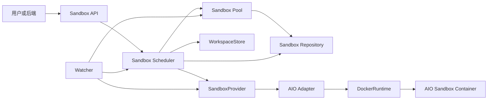
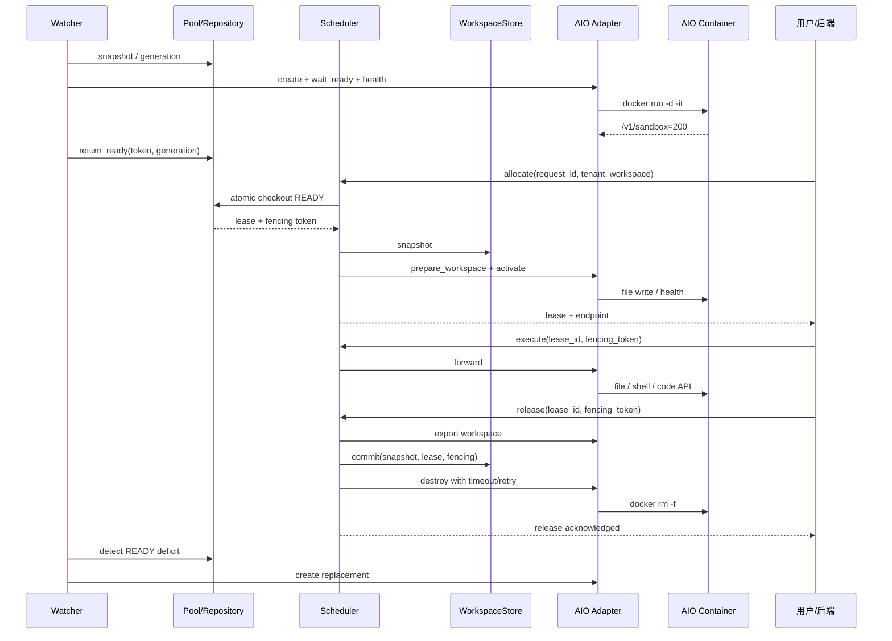

# WisePen 抽象沙箱管理服务

## 1. 文档说明

本文是 WisePen 沙箱系统的实现文档，合并了原 `docs/sandbox-design.md` 的设计、代码实现说明、提交演进、问题修复和真实 AIO 试跑结果。

系统由两个层次组成：

```text
wisepen-sandbox-service
    -> SandboxProvider
        -> wisepen-aio-adapter
            -> AIO Sandbox Container
```

`wisepen-sandbox-service` 只依赖平台无关的 `SandboxProvider`、`WorkspaceStore` 和 `LeaderLease` 端口，不导入 Docker、httpx 或 AIO DTO。所有 AIO 协议、Docker CLI 和平台路径差异都封装在 `wisepen-aio-adapter` 中。

当前实现采用进程内 Repository、WorkspaceStore 和 LeaderLease，便于开发和测试；后续可以替换为 Redis、Mongo 或对象存储实现，而不改变调度核心规则。

## 2. 设计目标与边界

系统通过预先启动一组空闲沙箱降低用户请求延迟。用户请求到来后，Scheduler 原子地取得 READY 沙箱，复制工作区、激活实例并创建短期租约。任务结束后，工作区提交回存储，沙箱默认销毁；Watcher 观察 READY 数量并补充新的预热实例。

设计目标：

- 预热实例只在健康检查完成后进入 READY Pool；
- 调度逻辑与 AIO、Docker 等具体平台解耦；
- 通过 request_id 幂等、租约和 fencing token 防止重复分配及旧请求写入；
- 用户实例不携带用户数据回 READY，避免跨租户状态泄漏；
- 通过 Watcher 自动恢复过期租约、清理超时实例并补充容量；
- 为后端协议和前端/VNC 协作者提供稳定的 lease、endpoint、错误码和状态边界。

本文不定义前端界面、VNC 编码/转发协议，也不实现完整 AIO SDK。Chat 端只应调用 Sandbox Service，不感知 AIO endpoint 的生成方式、Docker container ID 或 Adapter 内部 DTO。

## 3. 服务架构



### 3.1 `wisepen-sandbox-service`

- `SandboxPool`：维护 READY 沙箱，提供原子 checkout、快照和 `return_ready`。
- `SandboxScheduler`：负责 allocate、execute、release、过期租约恢复和销毁补偿。
- `Watcher`：周期性获取 Pool 快照，执行 LeaderLease 选主、恢复任务、预热和容量补充。
- `InMemorySandboxRepository`：以锁保护实例、租约、request 映射、状态转换、generation 和指标。
- `LocalWorkspaceStore`：开发/测试用本地工作区实现，校验租户、工作区和文件路径。
- `InMemoryLeaderLease`：同进程内的租约选主实现，作为未来分布式锁的端口示例。
- `MetricsCollector`：收集生命周期计数、耗时、readiness、租户活跃租约和失败率。
- `api.py` / `main.py`：提供内部 API 和进程启动时的 Watcher 后台任务。

### 3.2 `wisepen-aio-adapter`

- `DockerRuntime`：使用 Docker CLI 创建、inspect、获取动态端口和删除容器。
- `AioClient`：使用 httpx 调用最小 AIO HTTP API，统一处理响应包装、超时和错误。
- `AioSandboxProvider`：实现 SandboxProvider，将领域操作映射为 AIO 文件、Shell 和代码执行请求。
- `PathPolicy`：校验绝对/相对路径、`..`、反斜杠、租户和 workspace 隔离。
- `AdapterConfig`：配置镜像、AIO 端口、工作根目录、超时、TTY 和 e2e 标签。
- `errors.py` / `models.py`：仅保留当前文件、Shell、执行和 Docker 生命周期所需的本地错误和配置 DTO。

没有迁移完整的 TypeScript、Python 生成 SDK、Go SDK、浏览器、MCP、Jupyter、Node.js、网站、示例或评测代码。

## 4. 生命周期与领域模型

正常生命周期为：

```text
CREATING -> WARMING -> READY -> ALLOCATED -> RUNNING
RUNNING -> SYNCING -> DESTROYING -> DESTROYED
```

异常销毁最终进入 `LOST`，不回 READY。

| 状态 | 含义 | 允许的后继状态 |
| --- | --- | --- |
| `CREATING` | 已提交创建，尚未健康 | `WARMING`、`DESTROYING` |
| `WARMING` | 正在等待平台就绪 | `READY`、`DESTROYING` |
| `READY` | 健康且无租约，可 checkout | `ALLOCATED`、`DESTROYING` |
| `ALLOCATED` | 已绑定租约，正在准备环境 | `RUNNING`、`DESTROYING` |
| `RUNNING` | 用户正在使用 | `SYNCING`、`DESTROYING` |
| `SYNCING` | 正在提交工作区 | `DESTROYING` |
| `DESTROYING` | 正在调用平台销毁 | `DESTROYED`、`LOST` |
| `DESTROYED` | 已确认销毁 | 无 |
| `LOST` | 无法确认销毁或平台失联 | 无 |

非法状态转换由 Repository 统一抛出 `INVALID_STATE_TRANSITION`。用户实例不实现 reset/reuse，因此释放后不会直接回 READY。

核心标识包括 `sandbox_id`、`lease_id`、`request_id`、`tenant_id`、`workspace_id` 和 fencing token。`provider_id` 只在 Adapter 和内部记录中使用；管理 API 的状态响应会移除 provider_id、metadata 和 endpoint token。

### 4.1 Pool 原子语义

`checkout_ready()` 在同一把锁内完成 READY 选择、状态改为 ALLOCATED、租约创建、request 映射和单调 fencing token 分配。并发请求不会取得同一个沙箱。

Watcher 通过以下顺序将预热实例加入 Pool：

```text
WARMING
  -> prepare_readiness(health_token)
  -> return_ready(sandbox_id, health_token, expected_generation)
  -> READY
```

`return_ready` 要求状态为 WARMING、无 lease/request/tenant/workspace、health token 正确且 generation 未变化。用户释放路径禁止调用该接口。

### 4.2 租约与 fencing

- 同一 `request_id` 重试返回原租约；相同 request_id 携带不同租户或工作区返回 `REQUEST_CONFLICT`。
- 每次新分配生成单调 fencing token。
- execute 必须校验 lease_id、tenant_id、workspace_id、request_id 和 fencing token。
- 租约过期、release 开始或 fencing token 不匹配后，新的 execute 被拒绝。
- release 先关闭租约入口，再执行同步和销毁；重复 release 不重复 commit/destroy。

## 5. 端口与 API

### 5.1 SandboxProvider

```python
class SandboxProvider(Protocol):
    async def create(self, spec: SandboxSpec) -> SandboxRef: ...
    async def wait_ready(self, sandbox: SandboxRef, timeout_seconds: float) -> Health: ...
    async def health(self, sandbox: SandboxRef) -> Health: ...
    async def prepare_workspace(self, sandbox: SandboxRef, workspace: WorkspaceSnapshot) -> None: ...
    async def activate(self, sandbox: SandboxRef, lease: SandboxLease) -> Endpoint: ...
    async def forward(self, sandbox: SandboxRef, request: ExecutionRequest) -> ExecutionResult: ...
    async def export_workspace(self, sandbox: SandboxRef, tenant_id: str, workspace_id: str) -> WorkspaceSnapshot: ...
    async def destroy(self, sandbox: SandboxRef, reason: str) -> None: ...
```

Provider 方法由 Adapter 自己负责 HTTP/Docker 超时、可重试错误和 AIO 错误映射。destroy 对 404 幂等成功，平台原始异常不会直接泄漏到领域 API。

### 5.2 WorkspaceStore

```python
class WorkspaceStore(Protocol):
    async def snapshot(self, tenant_id: str, workspace_id: str) -> WorkspaceSnapshot: ...
    async def commit(self, snapshot: WorkspaceSnapshot, lease_id: str, fencing_token: int = 0) -> None: ...
```

LocalWorkspaceStore 会校验 tenant/workspace 标识、相对路径、符号链接和路径穿越。commit 失败时 Scheduler 仍继续 destroy，实例绝不回池。未创建的 workspace 目录可表示为空快照。

### 5.3 内部 API

| 方法与路径 | 行为 |
| --- | --- |
| `GET /healthz` | 只表示进程存活，不依赖 Pool 数量 |
| `GET /readyz` | READY 数量达到 min_ready 返回 200，否则返回 503 和 `MIN_READY_NOT_REACHED` |
| `POST /internal/sandboxes/allocate` | 校验 request/tenant/workspace，按 request_id 幂等分配 |
| `POST /internal/leases/{lease_id}/execute` | 只通过租约执行，校验上下文和 fencing token |
| `POST /internal/leases/{lease_id}/release` | 幂等关闭租约、提交工作区并销毁实例 |
| `GET /internal/sandboxes/{sandbox_id}` | 返回管理状态，不暴露 provider_id 和 token |
| `GET /internal/pool/metrics` | 返回 generation、状态计数、readiness 和生命周期指标 |

稳定错误码包括 `POOL_EMPTY`、`LEASE_NOT_FOUND`、`LEASE_EXPIRED`、`FENCING_REJECTED`、`REQUEST_CONFLICT`、`SANDBOX_UNAVAILABLE` 和 `WORKSPACE_SYNC_FAILED`。

## 6. 生命周期流程

### 6.1 Watcher 预热与恢复

每轮 Watcher 执行：

```text
LeaderLease.acquire
  -> Scheduler.recover_expired()
  -> 清理 CREATING/WARMING 超时实例
  -> 清理 DESTROYING 超时实例
  -> 读取 Pool snapshot 和 generation
  -> 计算缺口并创建预热实例
  -> health + return_ready
  -> LeaderLease.release
```

缺口计算为：

```text
deficit = max(0, target_ready + reserve - ready - warming - creating)
create_count = min(deficit, max_create_batch)
```

Watcher 会排除 CREATING/WARMING 实例，避免并发重复创建；预热失败使用有限重试和退避。warmup timeout 或 destroy failure 后实例进入 LOST。两个 Watcher 在同一进程共享 LeaderLease 时只有一个可以执行补池决策；内存实现不宣称跨进程选主能力。

### 6.2 allocate、execute、release

1. allocate 校验字段并按 request_id 查询幂等记录。
2. Pool 原子 checkout READY，生成 lease 和 fencing token。
3. Scheduler 从 WorkspaceStore 获取快照，调用 Provider.prepare_workspace。
4. Provider.activate 后状态进入 RUNNING，返回短期 endpoint 和租约信息。
5. execute 只接受 lease_id，校验租户、workspace、租约状态、有效期和 fencing token，再调用 Provider.forward。
6. release 原子关闭租约入口，状态进入 SYNCING。
7. Provider.export_workspace 后调用 WorkspaceStore.commit。
8. 无论 commit 成功或失败，都调用带超时和有限重试的 destroy。
9. destroy 成功进入 DESTROYED；超时/连续失败进入 LOST；成功销毁后清理租约映射。
10. Watcher 根据 READY 数量下降补充新的 WARMING 实例，健康后进入 READY。



### 6.3 失败补偿

| 失败点 | 处理 |
| --- | --- |
| create 失败 | 记录失败、退避，不创建 READY 实例 |
| wait_ready/health 超时 | 转 DESTROYING，销毁失败则 LOST |
| workspace prepare 失败 | 立即销毁，实例不回池 |
| activate 失败 | 销毁已 checkout 实例，返回 `SANDBOX_UNAVAILABLE` |
| execute 期间 AIO 失联 | 拒绝后续操作，交由恢复流程销毁 |
| workspace commit 失败 | 记录 `WORKSPACE_SYNC_FAILED`，仍继续销毁 |
| destroy 超时 | `wait_for`、指数退避和有限重试，最终 LOST |
| 租约过期 | Watcher 调用 Scheduler.recover_expired，不直接回 READY |

## 7. AIO Adapter 实现细节

### 7.1 Docker

当前真实 AIO 镜像为：

```text
enterprise-public-cn-beijing.cr.volces.com/vefaas-public/all-in-one-sandbox:latest
```

DockerRuntime 使用动态宿主机端口，将容器端口 8080 映射到 `127.0.0.1`，默认以 `-d -it` 启动。TTY 是必要配置：对该镜像验证发现普通 detached 容器会退出，而 `docker run -d -it` 可持续提供 HTTP 服务。真实测试可设置 `SANDBOX_E2E_LABEL=true`，只给测试容器增加 `wisepen.e2e=true` 标签，避免误删手动容器。

`-w /home/gem` 未继续传给 Docker。手动容器验证表明该镜像需要自身启动方式，`/home/gem` 只作为 AIO 文件 API 的可写工作根目录。

### 7.2 HTTP 协议映射

手动容器实际协议如下：

- 健康检查：`GET /v1/sandbox`，HTTP 200，响应包含 `success/message/data/home_dir/version/detail`；
- 文件写入/读取/列表/替换：`/v1/file/write`、`/v1/file/read`、`/v1/file/list`、`/v1/file/replace`；
- 文件搜索：实际为 `/v1/file/search`，请求字段为 `file`、`regex`，不是旧假设的 `/v1/file/grep`；
- Shell：`/v1/shell/exec`，响应包含 `session_id`、`command`、`status`、`output`、`console`、`exit_code`；
- 代码执行：`/v1/code/execute`，请求字段为 `language`、`code`，响应包含执行状态、stdout/stderr 和 exit_code；
- AIO 响应普遍使用 `data` 包装，AioClient 会解包后交给 Provider；
- 当前未发现 endpoint/token 必须认证的情况，但客户端保留 Authorization header 支持。

### 7.3 路径与工作区隔离

Provider 将每个工作区映射为：

```text
/home/gem/{tenant_id}/{workspace_id}/...
```

PathPolicy 拒绝空路径、越界绝对路径、`..`、非法租户/工作区标识和符号链接逃逸。list、search、Shell 默认使用当前 workspace 根，而不是整个 `/home/gem`。export 只读取当前作用域；目录不存在时返回空 WorkspaceSnapshot。

## 8. Metrics、安全与可观测性

`PoolSnapshot` 包含 generation、全部状态计数、Pool empty 次数、ready/min_ready/target_ready、readiness、低于 min_ready 的持续时间，以及以下生命周期指标：

- create/warmup/destroy 成功和失败次数；
- warmup、destroy 耗时和失败率；
- 过期租约恢复数、当前僵尸租约数；
- workspace commit 成功/失败次数；
- active leases by tenant；
- Watcher reconcile、非 leader 和低 readiness 统计。

metrics、状态查询和错误响应不返回 AIO token、workspace 内容、Docker container ID、完整异常堆栈或完整请求体。endpoint/token 只在 allocate 返回的短期租约上下文中使用，释放后失效。

## 9. 从 25a9157 起的实现演进

以下提交内容来自 `25a9157af6856dbeefaa07c939ae337feb57131b`（包含）之后的 Sandbox 实现，提交说明已在本分支整理为中文：

| 提交 | 内容 |
| --- | --- |
| `be7adb66` `refactor(Sandbox): 迁移沙箱服务` | 建立两层目录、领域端口、AIO Adapter、Pool/Scheduler/Watcher 骨架、Chat 工具入口和设计文档 |
| `3a914cf6` `refactor(Sandbox): 接入 Chat 沙箱依赖` | 将 Chat 文件、Shell、脚本工具统一接入 Sandbox Client，传递租约上下文 |
| `1eb48d1d` `feat(Sandbox): 完成抽象沙箱管理` | 实现状态机、Repository 原子操作、租约幂等、fencing、workspace 同步、Watcher 和内部 API |
| `c7cd99bc` `test(Sandbox): 覆盖生命周期与适配器契约` | 增加生命周期、错误映射、请求幂等、过期恢复和 Adapter fake 契约测试 |
| `0e0bcb65` `fix(Sandbox): 修复沙箱生命周期恢复与 AIO 适配` | 修复 Watcher recovery、readiness、metrics、return_ready、destroy 重试、真实 AIO 路径/协议、TTY 和工作区隔离 |
| `1055dbb4` `test(Sandbox): 补充生命周期与 AIO 契约测试` | 补充 health token、generation、active lease、AIO search/execute、TTY、e2e 标签和 metrics 测试 |

原始提交 `25a9157...` 至 `d1c0a207...` 的树内容保持不变，仅提交说明被重写为中文；后续两个新提交按运行时代码和测试代码拆分。

## 10. 测试与真实试跑结果

### 10.1 单元测试

执行方式：

```bash
cd services/wisepen-sandbox-service
PYTHONPATH=src pytest -q
# 14 passed

cd services/wisepen-aio-adapter
PYTHONPATH=src:../wisepen-sandbox-service/src pytest -q
# 7 passed
```

覆盖内容包括并发 checkout、非法状态、request_id 幂等、租户冲突、租约过期、fencing、return_ready、工作区路径、commit 失败销毁、release 幂等、Watcher 补池和 readiness metrics，以及 AIO HTTP、错误映射、真实 search/execute 字段、路径隔离、TTY 和 Docker 参数。

### 10.2 手动 AIO 容器探测

用户手动启动的容器使用宿主机 `8080`，测试从未销毁该容器。探测结果：

- `GET /v1/sandbox`：PASS，HTTP 200，版本 `1.0.0.156`；
- `/health`、`/v1/health`、`/openapi.json`：不可用，未作为健康路径；
- 文件写入、读取、列表、搜索、替换：PASS，工作根为 `/home/gem`；
- Shell 执行：PASS；
- Code Execute：PASS，使用 `language` + `code`；
- `/v1/file/grep`：不存在，已改用 `/v1/file/search`。

### 10.3 专用容器与服务全链路

所有测试专用容器都使用 `wisepen.e2e=true` 标签，并在每次试跑后确认清理完成。真实 Sandbox Service 试跑结果：

```text
Watcher warmup       PASS  CREATING -> WARMING -> READY
health/readiness     PASS  healthz=200, readyz=200
allocate             PASS  READY -> ALLOCATED -> RUNNING
execute              PASS  AIO code execution succeeded
Watcher replenish    PASS  用户实例占用后补充新的 READY 实例
fencing rejection    PASS  错误 fencing token 返回 409
release              PASS  workspace commit -> destroy -> DESTROYED
release repeat       PASS  幂等，不重复 commit/destroy
user not READY       PASS  用户实例未回 READY
metrics              PASS  generation/readiness/tenant metrics 可见且不泄密
e2e cleanup           PASS  无测试容器残留
```

第一次真实 release 暴露了“空 workspace 目录不存在”的边界，修复为 Adapter 返回空快照后再次试跑成功。

## 11. 已知限制与后续扩展

- 当前 Repository、WorkspaceStore 和 LeaderLease 是进程内实现，进程重启不会保留租约和 Pool 数据；跨进程选主需替换为外部存储/锁。
- AIO 镜像的 Docker 内置 healthcheck 可能因为 browser 子进程 SIGABRT 显示 `unhealthy`，但本次验证中 `/v1/sandbox` HTTP 接口可正常返回 200；生产环境应分别监控 Docker health 和 AIO HTTP health。
- 当前用户沙箱默认销毁，不支持 reset 后复用。
- 尚未实现真实 Redis/Mongo Repository、跨实例 Watcher 选主、文件大对象传输、VNC/Proxy 端到端和故障注入测试。
- AIO Adapter 只保留当前文件、Shell、代码执行和容器生命周期所需的最小协议，后续新增 AIO 能力仍应保持平台依赖在 Adapter 内部。
