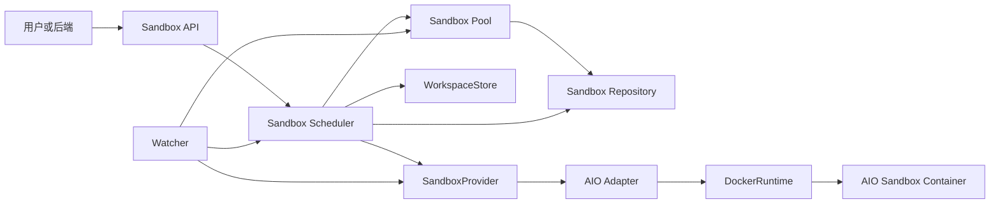
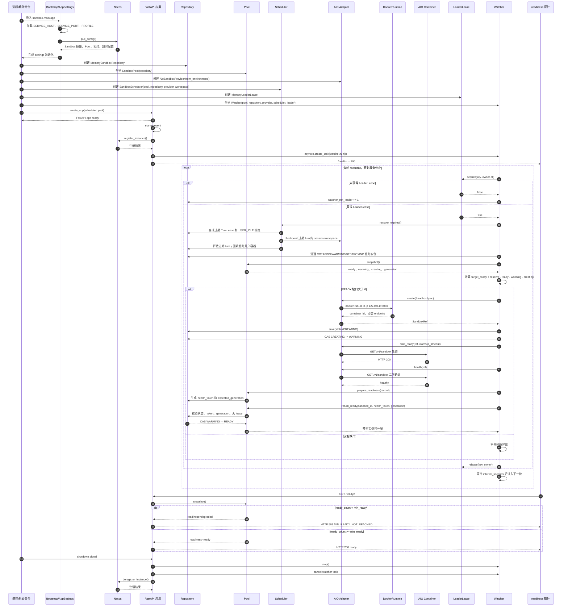
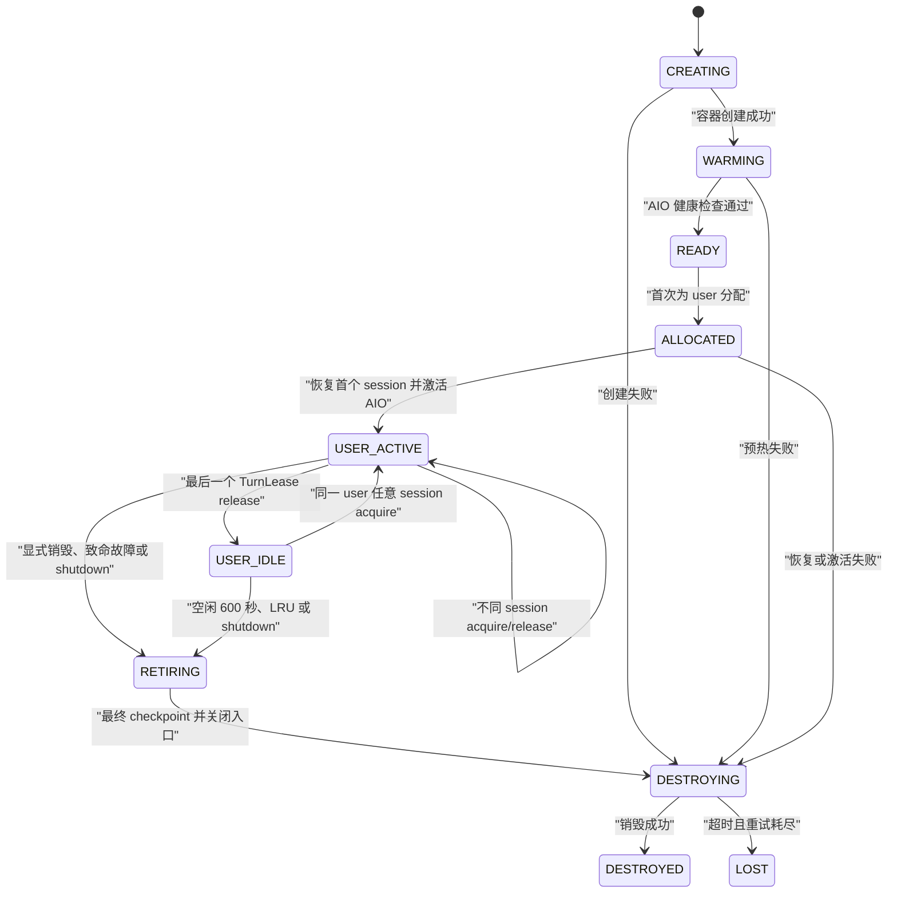
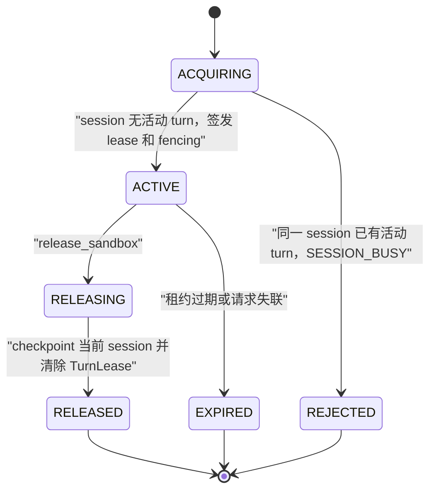
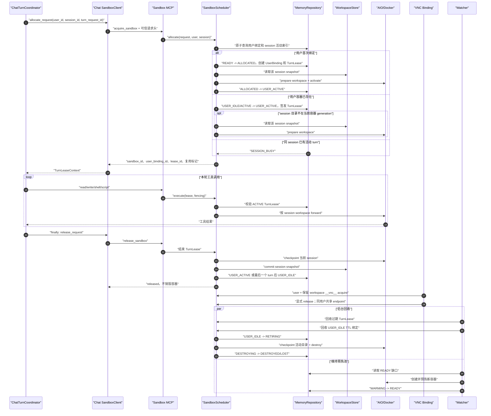

# WisePen 抽象沙箱管理服务

## 1. 文档说明

本文是 WisePen 沙箱系统的实现文档，合并了原 `docs/sandbox-design.md` 的设计、代码实现说明、提交演进、问题修复和真实 AIO 试跑结果。

系统由两个层次组成：

```text
wisepen-sandbox-service
    -> application services
        -> domain interfaces
            -> core.providers.aio_adapter
            -> AIO Sandbox Container
```

`wisepen-sandbox-service` 通过 `domain.interfaces` 暴露平台无关的 `SandboxProvider`、`WorkspaceStore` 和 `LeaderLease` 端口；AIO 协议、Docker CLI 和平台路径差异封装在 `core.providers.aio_adapter` 中。

当前 Repository 和 LeaderLease 是进程内实现，本版本只支持单个 Sandbox Service 实例。WorkspaceStore 可使用本地或 Mongo 实现；多实例共享用户绑定、session workspace 和 TurnLease 状态需另行设计。

## 2. 设计目标与边界

系统通过预先启动一组空闲沙箱降低首次请求延迟。Scheduler 首次为 `user_id` 取得 READY 沙箱并建立稳定的用户绑定；该用户的每个 session 映射为容器内独立目录 `/home/gem/workspaces/{user_id}/{session_id}`。正常 release 只结束本轮 TurnLease 并 checkpoint 当前 session；最后一个 TurnLease 结束后容器进入 `USER_IDLE`，由用户级 TTL、LRU、显式用户销毁、致命故障或 shutdown 最终回收。

设计目标：

- 预热实例只在健康检查完成后进入 READY Pool；
- 调度逻辑与 AIO、Docker 等具体平台解耦；
- 通过 request_id 幂等、租约和 fencing token 防止重复分配及旧请求写入；
- 用户实例不携带用户数据回 READY，避免跨租户状态泄漏；
- 通过 Watcher 自动恢复过期租约、清理超时实例并补充容量；
- 为后端协议和前端/VNC 协作者提供稳定的 lease、endpoint、错误码和状态边界。

本文不定义前端界面、VNC 编码/转发协议，也不实现完整 AIO SDK。Chat 端只应调用 Sandbox Service，不感知 AIO endpoint 的生成方式、Docker container ID 或 Adapter 内部 DTO。

## 3. 服务架构



### 3.1 `wisepen-sandbox-service`

- `application/services`：维护 Pool、Scheduler 和 Watcher 的生命周期用例。
- `domain`：保存领域实体、错误码、端口和 Repository 协议。Repository 按职责拆分为四个 Protocol：`SandboxRepository`（池与记录 CRUD）、`LeaseManager`（TurnLease 生命周期）、`BindingManager`（用户-容器绑定）和 `WorkspaceManager`（Session 工作区记录）。
- `core/storage/memory`：提供内存实现。`MemorySandboxRepository` 作为组合根，内部持有共享 `_RepositoryState`（一个锁 + 所有索引），并实例化 `MemoryLeaseManager`、`MemoryBindingManager` 和 `MemoryWorkspaceManager` 三个子管理器。Scheduler 和 Watcher 通过 `getattr(repository, "lease_manager", repository)` 从 Repository 自动提取所需的子管理器，无需额外构造参数。
- `core/storage/local` / `core/observability`：提供本地 Workspace Store 和 Metrics 实现。
- `apis` / `main.py`：提供内部 API、路由和进程启动时的 Watcher 后台任务。shutdown 时并行执行 Scheduler 优雅关闭和 `cleanup_owned()` Docker label 兜底清理，确保在 Docker 的 `stop_grace_period` 内完成。

### 3.2 `core.providers.aio_adapter`

- `DockerRuntime`：使用 Docker CLI 创建、inspect、获取动态端口和删除容器。
- `AioClient`：使用 httpx 调用最小 AIO HTTP API，统一处理响应包装、超时和错误。
- `AioSandboxProvider`：实现 SandboxProvider，将领域操作映射为 AIO 文件、Shell 和代码执行请求。
- `PathPolicy`：校验绝对/相对路径、`..`、反斜杠、租户和 workspace 隔离。
- `AdapterConfig`：配置镜像、AIO 端口、工作根目录、超时、TTY 和 e2e 标签。
- `models.py`：保存当前文件、Shell、执行和 Docker 生命周期所需的配置 DTO；错误统一使用 common 的 `ServiceException` 和本目录的 `error_codes.py`。

没有迁移完整的 TypeScript、Python 生成 SDK、Go SDK、浏览器、MCP、Jupyter、Node.js、网站、示例或评测代码。

## 4. 生命周期与领域模型

正常生命周期为：

```text
CREATING -> WARMING -> READY -> ALLOCATED -> USER_ACTIVE
USER_ACTIVE -> USER_IDLE -> USER_ACTIVE
USER_IDLE -> RETIRING -> DESTROYING -> DESTROYED
```

异常销毁最终进入 `LOST`，不回 READY。

| 状态 | 含义 | 允许的后继状态 |
| --- | --- | --- |
| `CREATING` | 已提交创建，尚未健康 | `WARMING`、`DESTROYING` |
| `WARMING` | 正在等待平台就绪 | `READY`、`DESTROYING` |
| `READY` | 健康且无租约，可 checkout | `ALLOCATED`、`DESTROYING` |
| `ALLOCATED` | READY 容器已绑定用户，正在恢复首个 session 并激活 AIO | `USER_ACTIVE`、`RETIRING`、`DESTROYING` |
| `USER_ACTIVE` | 用户容器至少有一个活动 TurnLease | `USER_IDLE`、`RETIRING`、`DESTROYING` |
| `USER_IDLE` | 用户绑定保留，当前无活动 TurnLease | `USER_ACTIVE`、`RETIRING`、`DESTROYING` |
| `RETIRING` | 用户绑定已关闭，准备最终回收 | `DESTROYING` |
| `RUNNING`、`CHECKPOINTING`、`SESSION_IDLE`、`SYNCING` | 历史查询兼容状态，新流程不再写入 | `RETIRING`、`DESTROYING` |
| `DESTROYING` | 正在调用平台销毁 | `DESTROYED`、`LOST` |
| `DESTROYED` | 已确认销毁 | 无 |
| `LOST` | 无法确认销毁或平台失联 | 无 |

非法状态转换由 Repository 统一抛出 `INVALID_STATE_TRANSITION`。用户实例不会回公共 READY 池；它只允许绑定的 `user_id` 使用，但该用户的多个 session 可以共享容器并并发执行。

核心标识包括 `sandbox_id`、`lease_id`、`request_id`、`tenant_id`、`workspace_id` 和 fencing token。`provider_id` 只在 Adapter 和内部记录中使用；管理 API 的状态响应会移除 provider_id、metadata 和 endpoint token。

### 4.1 Pool 原子语义

`checkout_ready()` 在同一把 Repository 锁内完成用户绑定查询或 READY 选择、状态变更、session 活动索引、request 映射和单调 fencing token 分配。不同用户不会取得同一个沙箱；同一用户的不同 session 会取得同一沙箱；同一 session 已有活动 TurnLease 时立即返回 `SESSION_BUSY`。

Watcher 通过以下顺序将预热实例加入 Pool：

```text
WARMING
  -> prepare_readiness(health_token)
  -> return_ready(sandbox_id, health_token, expected_generation)
  -> READY
```

`return_ready` 要求状态为 WARMING、无 lease/request/tenant/workspace、health token 正确且 generation 未变化。用户释放路径禁止调用该接口。

### 4.2 租约与 fencing

- 活动 TurnLease 的同一 `request_id` 重试返回原租约；租约已关闭后重试返回 `LEASE_EXPIRED`；相同 request_id 携带不同用户或 session 返回 `REQUEST_CONFLICT`。
- 每次新分配生成单调 fencing token。
- execute 必须校验 lease_id、tenant_id、workspace_id、request_id 和 fencing token。
- 租约过期、release 开始或 fencing token 不匹配后，新的 execute 被拒绝。
- release 先关闭 TurnLease 入口，再 checkpoint 当前 session；最后一个 TurnLease 结束后进入 `USER_IDLE`。重复 release 不重复 commit，也不销毁健康容器。

## 5. 端口与 API

### 5.1 领域端口（Protocol）

Repository 层按职责拆分为四个 Protocol，Scheduler 和 Watcher 仅依赖各自所需的子集：

```python
class SandboxRepository(Protocol):
    """池与 SandboxRecord CRUD + 原子 checkout。"""
    @property
    def metrics(self) -> MetricsPort: ...
    async def save(self, record: SandboxRecord) -> None: ...
    async def get(self, sandbox_id: str) -> SandboxRecord | None: ...
    async def records_in(self, states: Iterable[SandboxState]) -> list[SandboxRecord]: ...
    async def snapshot(self, *, min_ready, target_ready) -> PoolSnapshot: ...
    async def transition(self, sandbox_id, expected, state, *, error=None) -> SandboxRecord: ...
    async def checkout_ready(self, request_id, user_id, session_id,
                             lease_ttl, user_idle_ttl, max_bindings) -> tuple[SandboxRecord, LeaseRecord]: ...
    async def prepare_ready(self, record, readiness_token) -> int: ...
    async def return_ready(self, sandbox_id, health_token, generation) -> SandboxRecord: ...
    async def records_older_than(self, state, cutoff) -> list[SandboxRecord]: ...

class LeaseManager(Protocol):
    """TurnLease 生命周期。"""
    async def find_lease / get_turn_lease / find_turn_request / active_turn_for_session / active_turns_for_sandbox: ...
    async def close_lease / validate_lease / finish_release / expired_turn_leases: ...

class BindingManager(Protocol):
    """用户-容器绑定。"""
    async def find_user_binding / binding_for_sandbox / user_bindings / idle_user_bindings / expired_idle_user_bindings: ...
    async def activate_user_binding / clear_binding: ...

class WorkspaceManager(Protocol):
    """Session 工作区记录。"""
    async def find_workspace / workspaces_for_user / mark_workspace_prepared / mark_workspace_dirty / remove_workspace: ...
```

`MemorySandboxRepository` 实现全部四个 Protocol，内部通过共享 `_RepositoryState`（一个 `asyncio.Lock` + 所有索引字典）保证原子性。Scheduler 和 Watcher 通过 `getattr(repository, "lease_manager", repository)` 自动提取子管理器；传入未拆分的 mock 时回退到直接使用 repository 自身，保持测试兼容。

### 5.2 SandboxProvider

```python
class SandboxProvider(Protocol):
    async def validate_deployment(self) -> None: ...
    async def create(self, spec: SandboxSpec) -> SandboxRef: ...
    async def wait_ready(self, sandbox: SandboxRef, timeout_seconds: float) -> Health: ...
    async def health(self, sandbox: SandboxRef) -> Health: ...
    async def prepare_workspace(self, sandbox: SandboxRef, workspace: WorkspaceSnapshot) -> None: ...
    async def activate(self, sandbox: SandboxRef, lease: SandboxLease) -> Endpoint: ...
    async def forward(self, sandbox: SandboxRef, request: ExecutionRequest) -> ExecutionResult: ...
    async def export_workspace(self, sandbox: SandboxRef, tenant_id: str, workspace_id: str) -> WorkspaceSnapshot: ...
    async def checkpoint_workspace(self, sandbox: SandboxRef, tenant_id, workspace_id, lease_id, fencing_token) -> WorkspaceSnapshot: ...
    async def delete_workspace(self, sandbox: SandboxRef, tenant_id: str, workspace_id: str) -> None: ...
    async def destroy(self, sandbox: SandboxRef, reason: str) -> None: ...
```

Provider 方法由 Adapter 自己负责 HTTP/Docker 超时、可重试错误和 AIO 错误映射。destroy 对 404 幂等成功，平台原始异常不会直接泄漏到领域 API。`checkpoint_workspace` 与 `export_workspace` 的差异在于前者接受 fencing token 用于租约级校验；`FileTransferPort` 负责实际的 `docker cp` 传输。

### 5.3 WorkspaceStore

```python
class WorkspaceStore(Protocol):
    async def snapshot(self, tenant_id: str, workspace_id: str) -> WorkspaceSnapshot: ...
    async def commit(self, snapshot: WorkspaceSnapshot, lease_id: str, fencing_token: int = 0) -> None: ...
```

LocalWorkspaceStore 会校验 tenant/workspace 标识、相对路径、符号链接和路径穿越。缓存范围是 `user_id + session_id`。commit 采用完整快照替换语义：本次导出不存在的旧文件会从缓存中删除，并写入 manifest 记录 lease、fencing、文件数和字节数。普通 release 的 commit 失败会记录降级状态，健康实例仍可进入 `USER_IDLE`；最终回收时 commit 失败不阻止 destroy。未创建的 workspace 目录可表示为空快照。

### 5.4 内部 API

Sandbox API 与 Chat API 使用相同的接口表达约定：HTTP 端点按域位于 `sandbox.api.endpoints.health`、`pool` 和 `sandbox`；每个模块在顶层声明 `APIRouter` 和端点函数，并通过 `sandbox.container.Container` 注入 `SandboxPool` 或 `SandboxScheduler`。对应 Pydantic DTO 分别位于 `sandbox.api.schemas.health`、`pool` 和 `sandbox`，并由 `sandbox.api.schemas` 统一导出。业务接口使用 `R(code/msg/data)` 包装，并在端点上提供 `summary`、详细 `description` 和 `response_model`。健康探针保留裸 JSON 和 HTTP 503 语义，避免影响容器编排和负载均衡。

启动服务后可通过以下入口查看机器可读和交互式文档：

- Swagger UI：`GET /docs`
- OpenAPI JSON：`GET /openapi.json`

| 方法与路径 | 请求 | 成功响应 | 主要失败 |
| --- | --- | --- | --- |
| `GET /healthz` | 无 | `{"status":"ok"}`，HTTP 200 | 进程无响应 |
| `GET /readyz` | 无 | `{"status":"ready","ready":N,"min_ready":M}`，HTTP 200 | READY 不足 -> HTTP 503、`MIN_READY_NOT_REACHED` |
| `POST /internal/sandboxes/allocate` | `request_id`、`tenant_id=user_id`、`workspace_id=session_id` | `R[SandboxLeaseResponse]` | `POOL_EMPTY`、`SESSION_BUSY`、`USER_SANDBOX_CAPACITY`、`REQUEST_CONFLICT` |
| `POST /internal/leases/{lease_id}/execute` | `request_id`、用户/session、`fencing_token`、`operation`、`payload` | `R[ExecutionResultResponse]` | `LEASE_NOT_FOUND`、`LEASE_EXPIRED`、`FENCING_REJECTED`、`EXECUTION_TIMEOUT` |
| `POST /internal/leases/{lease_id}/release` | `fencing_token` | `R[{"status":"released"}]`，最后一个 turn 后进入 `USER_IDLE` | `LEASE_NOT_FOUND`、`FENCING_REJECTED` |
| `POST /internal/sandbox-workspaces/delete` | `tenant_id=user_id`、`workspace_id=session_id` | 删除 session 目录和快照，用户容器保留 | `SANDBOX_UNAVAILABLE` |
| `POST /internal/user-sandboxes/destroy` | `user_id` | 销毁用户绑定和物理容器，幂等返回 | `SANDBOX_UNAVAILABLE` |
| `GET /internal/sandboxes/{sandbox_id}` | 无 | `R[SandboxStatusResponse]` | `LEASE_NOT_FOUND` |
| `GET /internal/pool/metrics` | 无 | `R[PoolMetricsResponse]` | `SYSTEM_ERROR` |

#### 5.4.1 分配、执行和释放示例

分配请求：

```json
{
  "request_id": "chat-turn-123",
  "tenant_id": "user-10001",
  "workspace_id": "session-20001"
}
```

分配响应中的 `data.lease_id`、`data.fencing_token` 和 `data.endpoint` 供同一租约的后续操作使用：

```json
{
  "code": 200,
  "msg": "操作成功",
  "data": {
    "lease_id": "lease_1",
    "request_id": "chat-turn-123",
    "sandbox_id": "sandbox-1",
    "tenant_id": "user-10001",
    "workspace_id": "session-20001",
    "expires_at": "2026-07-29T10:00:00Z",
    "fencing_token": 1,
    "user_binding_id": "user_f85c...",
    "user_idle_expires_at": null,
    "container_reused": false,
    "workspace_reused": false,
    "endpoint": {"base_url": "http://sandbox:8080", "token": null}
  }
}
```

执行请求通过租约路径传递 fencing token：

```json
{
  "request_id": "tool-call-456",
  "tenant_id": "user-10001",
  "workspace_id": "session-20001",
  "fencing_token": 1,
  "operation": "shell_exec",
  "payload": {"command": "python main.py"}
}
```

释放请求只需要 fencing token。释放入口先关闭本轮执行，再提交当前 session 的完整快照；成功响应为 `data.status = "released"`。重复释放保持幂等。删除 Chat session 使用 workspace delete；只有用户 TTL、LRU、管理端强制销毁或 shutdown 才销毁物理容器。

#### 5.4.2 状态、指标和安全边界

状态接口返回生命周期状态、租约上下文和非敏感 endpoint 地址。`provider_id`、Provider metadata、endpoint token 和 readiness token 属于 Sandbox Service 内部信息，不会出现在状态响应中。allocate 响应中的 endpoint token 只服务于当前短期租约，释放后失效。

metrics 响应固定包含 `generation`、`empty_checkouts`、`min_ready` 和 `target_ready`，并携带 readiness、状态计数、租约、预热、销毁和 workspace 同步指标。后续新增指标会作为 `data` 的额外字段返回。

稳定错误码包括 `POOL_EMPTY`、`SESSION_BUSY`、`USER_SANDBOX_CAPACITY`、`LEASE_NOT_FOUND`、`LEASE_EXPIRED`、`FENCING_REJECTED`、`REQUEST_CONFLICT`、`SANDBOX_UNAVAILABLE`、`WORKSPACE_SYNC_FAILED`、`WORKSPACE_CACHE_LIMIT_EXCEEDED`、`INVALID_EXECUTION_TIMEOUT` 和 `EXECUTION_TIMEOUT`。

## 6. 生命周期流程

### 6.1 服务启动与预热队列初始化

标准进程入口是 `sandbox.main:app`。启动时先加载引导配置和 Sandbox 业务配置，创建 Repository、Pool、Provider、Scheduler、WorkspaceStore、LeaderLease 和 Watcher，再把 Watcher 作为 FastAPI 后台任务启动。标准启动方式会在配置加载阶段从 Nacos 拉取业务配置，并在应用 startup/shutdown 阶段注册和注销服务；无 Nacos 的开发演示可以使用 README 前文描述的直接组装 launcher，但生命周期顺序不变。

服务启动阶段只负责把 AIO 容器预热到 READY Pool，不会创建用户 lease，也不会执行用户工具。`/healthz` 只表示进程已存活，Watcher 可能仍在创建容器；只有 READY 数达到 `min_ready` 后，`/readyz` 才返回 200，Chat 的 allocate 才能取得可用实例。

#### 6.1.1 UML 泳道图



#### 6.1.2 启动阶段的状态和可用性

1. **配置和装配**：配置加载完成后才创建运行时对象。Repository 和 LeaderLease 当前是进程内实现；服务重启后 Pool、generation 和 lease 映射会重新开始。
2. **应用存活**：FastAPI startup 创建 Watcher 任务后，`/healthz` 即可返回 200。这个返回值不代表已有 READY 容器。
3. **Watcher 首轮 reconcile**：Watcher 先获取 LeaderLease，再调用 `Scheduler.recover_expired()`，清理旧状态，最后根据 `ready + warming + creating` 计算缺口。
4. **容器预热**：新容器先保存为 `CREATING`，然后进入 `WARMING`。只有 Docker 创建成功、动态 endpoint 可访问、`GET /v1/sandbox` 健康检查成功，并且 `return_ready()` 的 health token 和 generation 校验通过，实例才进入 `READY`。
5. **对 Chat 开放**：`/readyz` 在 READY 数量达到 `min_ready` 后变为 200。Chat 请求随后调用 allocate，从 READY Pool checkout，而不是在 Chat 工具调用时临时创建容器。
6. **预热失败**：健康检查、generation 或 `return_ready()` 失败时，实例进入销毁流程；销毁失败或无法确认时进入 `LOST`，不会进入 READY。Watcher 记录失败指标并按配置退避重试。
7. **服务停止**：停止时取消 Watcher 后台任务并注销服务。当前内存 Repository 不负责跨进程恢复，未完成实例的外部收敛需要后续接入持久化 Repository。

### 6.2 Watcher 预热与恢复

每轮 Watcher 执行：

```text
LeaderLease.acquire
  -> Scheduler.recover_expired()
  -> 清理 CREATING/WARMING 超时实例
  -> 清理 DESTROYING 超时实例（先重试销毁，失败才标记 LOST）
  -> 读取 Pool snapshot 和 generation
  -> 计算缺口并创建预热实例
  -> health + return_ready
  -> LeaderLease.release
```

缺口计算为：

```text
deficit = max(0, target_ready + reserve - ready - warming - creating)
create_count = min(deficit, max_create_batch)
```

Watcher 会排除 CREATING/WARMING 实例，避免并发重复创建；预热失败使用有限重试和退避。预热成功后的 `_recover_stale` 将容器标记为 DESTROYED（非 LOST）；预热阶段失败后的 cleanup 也根据销毁是否成功区分 DESTROYED 和 LOST。两个 Watcher 在同一进程共享 LeaderLease 时只有一个可以执行补池决策；LeaderLease 续期失败后持续重试而非放弃，避免续期瞬间中断导致的重复补池。

**自适应空闲间隔**：连续 `idle_rounds_threshold`（默认 3）轮无需补池后，Watcher 将轮询间隔从 `interval_seconds`（默认 5s）提升至 `idle_interval_seconds`（默认 60s），以节省 leader 租约获取和快照计算开销。一旦检测到缺口（容器被 checkout），立即恢复 5s 的正常间隔。外部也可调用 `watcher.wakeup()` 主动退出空闲模式。

### 6.3 allocate、execute、release

1. allocate 校验字段并按 request_id 查询活动幂等记录，再原子检查 `(user_id, session_id)` 是否已有 TurnLease。
2. 已有用户绑定时直接复用容器；新用户才从 Pool checkout READY 并创建 `UserSandboxBindingRecord`。
3. session 目录未驻留于当前容器 generation 时，从 WorkspaceStore 恢复并调用 Provider.prepare_workspace；已有目录则直接复用。
4. 新用户容器 activate 后进入 `USER_ACTIVE`；每轮返回独立 lease 和 fencing token。
5. execute 校验用户、session、租约状态、有效期和 fencing token，再在 session workspace 锁内调用 Provider.forward。不同 session 不共享执行锁。
6. release 原子关闭 TurnLease，checkpoint 当前 session 并提交完整快照。
7. 若仍有其他活动 TurnLease，容器保持 `USER_ACTIVE`；否则进入 `USER_IDLE` 并设置 600 秒空闲期限。
8. Watcher 回收过期 TurnLease 和超时的 `USER_IDLE` 绑定，并维持 READY Pool；普通 release 不触发 destroy。

```mermaid
sequenceDiagram
    participant W as Watcher
    participant P as Pool/Repository
    participant S as Scheduler
    participant F as WorkspaceStore
    participant A as AIO Adapter
    participant C as AIO Container
    participant U as 用户/后端

    W->>P: snapshot / generation
    W->>A: create + wait_ready + health
    A->>C: docker run -d -it
    C-->>A: /v1/sandbox=200
    W->>P: return_ready(token, generation)
    U->>S: allocate(request_id, user, session)
    S->>P: atomic lookup user binding / checkout READY
    P-->>S: user binding + TurnLease + fencing
    opt session workspace 尚未驻留
        S->>F: snapshot(user, session)
        S->>A: prepare_workspace
    end
    S->>A: 首次用户绑定时 activate
    S-->>U: lease + endpoint
    U->>S: execute(lease_id, fencing_token)
    S->>A: forward in session workspace
    A->>C: file / shell / code API
    U->>S: release(lease_id, fencing_token)
    S->>A: checkpoint session workspace
    S->>F: commit(snapshot, lease, fencing)
    S->>P: USER_ACTIVE or USER_IDLE
    S-->>U: release acknowledged; container retained
    W->>P: reclaim expired turns / idle users / detect READY deficit
```

### 6.4 用户级容器复用与 Session Workspace 并发

物理容器的复用边界是 `user_id`，在 Sandbox API 中沿用 `tenant_id` 字段传递；`workspace_id` 对应 `session_id`。一个用户稳定绑定一个 AIO 容器，该用户的多个 session 分别使用容器内独立目录。不同 session 可通过 AIO 的多个 Shell 终端并发执行，不设置每用户业务并发上限；同一 session 仅允许一个活动 TurnLease，冲突时 Repository 原子返回 `SESSION_BUSY`，不建立等待队列。

Repository 分开维护四类记录：

| 记录 | 生命周期 | 权威字段 |
| --- | --- | --- |
| `SandboxRecord` | Docker/AIO 容器 | `sandbox_id`、用户 owner、容器状态、活动 turn 数、最近错误 |
| `UserSandboxBindingRecord` | user 到容器的稳定绑定 | `user_binding_id`、`user_id`、`sandbox_id`、空闲期限、复用次数 |
| `SessionWorkspaceRecord` | session 在用户容器内的目录 | `user_id`、`session_id`、容器 generation、dirty/checkpoint 状态 |
| `TurnLeaseRecord` | 一轮 Chat 或 VNC 操作 | `request_id`、`lease_id`、session、过期时间、fencing token、释放时间 |

Chat `SandboxClient` 的本地用户绑定缓存只用于复用信息和清理优化，Sandbox Repository 才是权威状态。当前 Repository 为进程内存实现，因此本版本只支持单个 Sandbox Service 实例；多个实例会导致用户绑定、session 活动索引和 fencing 状态分裂。

#### 6.4.1 用户容器状态机



正常 `release_sandbox` 只关闭当前 TurnLease 并 checkpoint 当前 session。还有其他 session 活动时容器保持 `USER_ACTIVE`；最后一个 TurnLease 结束后进入 `USER_IDLE`。容器不会回公共 READY 池。同一用户再次 acquire 时直接复用 AIO 容器；仅当对应 session 目录尚未驻留于当前容器 generation 时才从 WorkspaceStore 恢复。

删除 session 只删除其容器目录和 WorkspaceStore 快照，不销毁用户容器。只有显式用户销毁、用户容器空闲 TTL、LRU 淘汰、确认的 AIO 致命故障或服务关闭才进入 `RETIRING` 并销毁物理容器。TurnLease 过期只结束该 turn；若没有其他活动 turn，容器进入 `USER_IDLE`。

#### 6.4.2 TurnLease 与并发约束



活动 TurnLease 的同一 `request_id` 重试返回原租约；已释放 request 返回 `LEASE_EXPIRED`；相同 request ID 携带不同 user/session 返回 `REQUEST_CONFLICT`。同一 session 的第二个 request 在 Repository 锁内立即返回 `SESSION_BUSY`，没有 Condition、等待队列或 acquire wait timeout。Chat 多端已限制同一 SSE，`SESSION_BUSY` 是低成本的最终防抖约束。

不同 session 的 execute 不持有全局 lifecycle lock，只使用各自的 workspace 锁，因此一个长 Shell 等待时其他 session 仍可继续调用同一 AIO 容器。Shell 和常用脚本语言接受 `timeout_ms`，由 Nacos 的默认值和最大值归一化后传给 AIO。AIO exec 超时返回 `status=running` 时，Client 使用返回的 Shell session ID 调用 `/v1/shell/kill` 清理进程树，再返回 `EXECUTION_TIMEOUT`；共享用户容器不销毁。

#### 6.4.3 Chat、MCP、VNC 与 Watcher 时序



Chat 每轮仍在 `finally` 调用 release，但 release 只结束 TurnLease。`deleteSession` 校验会话归属后调用 `delete_sandbox_workspace`；Sandbox 暂时不可用时记录错误并继续删除 Chat 数据，用户容器由 TTL 回收。`destroy_sandbox_session` 保留为 workspace delete 的兼容别名，不再表示销毁物理容器。VNC 按 user 共享 endpoint，并通过保留 workspace `__vnc__` 的 TurnLease 维持活跃状态。

#### 6.4.4 容量、API 与配置

最多保留 `SANDBOX_MAX_USER_BINDINGS` 个用户绑定容器。新用户到达且容量已满时，Scheduler 淘汰最久未使用的 `USER_IDLE` 绑定；没有空闲用户容器可淘汰时返回 `USER_SANDBOX_CAPACITY`。session 数量和同用户不同 session 的业务并发不设置单独上限，实际容量由 AIO 和宿主机资源约束。公共 READY Pool 与用户绑定容量分别统计。

新增或变更的接口：

| 接口 | 语义 |
| --- | --- |
| MCP `acquire_sandbox` | 返回 TurnLease、`user_binding_id`、用户空闲期限以及容器/workspace 复用标记 |
| MCP `release_sandbox` | 结束本轮 TurnLease并 checkpoint 当前 session，不销毁用户容器 |
| MCP `delete_sandbox_workspace` | 删除可信请求头中 user/session 对应的目录和快照 |
| MCP `destroy_sandbox_session` | `delete_sandbox_workspace` 的兼容别名 |
| `POST /internal/leases/{lease_id}/release` | 与 MCP release 相同，不销毁健康容器 |
| `POST /internal/sandbox-workspaces/delete` | 按 user/session 删除 workspace |
| `POST /internal/user-sandboxes/destroy` | 管理端按 user 强制销毁物理容器 |
| `GET /internal/sandboxes/{sandbox_id}` | 返回 owner、活动 turn 数、用户绑定和复用次数 |

配置默认值：

```text
SANDBOX_USER_REUSE_ENABLED=true
SANDBOX_USER_IDLE_TTL_SECONDS=600
SANDBOX_MAX_USER_BINDINGS=20
SANDBOX_EXECUTION_DEFAULT_TIMEOUT_MS=30000
SANDBOX_EXECUTION_MAX_TIMEOUT_MS=120000
SANDBOX_EXECUTION_TRANSPORT_GRACE_SECONDS=5
```

acquire 不等待同 session 的既有 turn。专用 MCP client 优先读取 `result.content`，确保 `SESSION_BUSY`、`USER_SANDBOX_CAPACITY` 和 `POOL_EMPTY` 不会被空的 `structuredContent` 序列化为 `null`。执行 transport timeout 应大于允许的 AIO 任务 timeout，并包含 grace 时间。

#### 6.4.5 指标与降级规则

Pool metrics 包含活动/空闲用户绑定、活动 TurnLease、用户容器复用命中、新建用户绑定、`SESSION_BUSY` 拒绝、TTL/LRU 回收、执行超时和 checkpoint 降级等计数，可用“用户容器复用命中 / allocate 成功”计算容器复用率。

WorkspaceStore commit 失败会记录 `workspace_checkpoint_degraded` 和 `last_error`，但健康 AIO 不因普通 release 的存储故障立即销毁。租约过期会结束 turn；显式用户 destroy 和服务 shutdown 会尽力 checkpoint 活动 session，即使失败也继续销毁。
### 6.5 失败补偿

| 失败点 | 处理 |
| --- | --- |
| create 失败 | 记录失败、退避，不创建 READY 实例 |
| wait_ready/health 超时 | 转 DESTROYING，销毁失败则 LOST |
| workspace prepare 失败 | 立即销毁，实例不回池 |
| activate 失败 | 销毁已 checkout 实例，返回 `SANDBOX_UNAVAILABLE` |
| execute 期间 AIO 失联 | 拒绝后续操作，交由恢复流程销毁 |
| 普通 release 的 workspace commit 失败 | 记录 checkpoint 降级和 `last_error`，健康容器继续保留 |
| 最终回收的 workspace commit 失败 | 记录降级，仍继续销毁 |
| 同 session 并发 acquire | Repository 原子检查并立即返回 `SESSION_BUSY` |
| 用户绑定达到上限 | 淘汰最久未使用的 `USER_IDLE`；无可淘汰项则返回 `USER_SANDBOX_CAPACITY` |
| 用户容器空闲超过 600 秒 | Watcher 最终回收用户容器，记录 TTL 指标 |
| Shell/Python/Node/Shell 脚本超过 Nacos timeout | Sandbox 调用 AIO Shell kill 清理目标进程树，返回 `EXECUTION_TIMEOUT`，共享容器保持可用 |
| destroy 超时 | `wait_for`、指数退避和有限重试，最终 LOST |
| 租约过期 | Watcher 调用 `recover_expired`，checkpoint 当前 session 并释放 TurnLease；用户容器按是否仍有活动 turn 进入 `USER_ACTIVE` 或 `USER_IDLE` |
| 服务关闭时容器残留 | `scheduler.shutdown()` 并行销毁（`asyncio.wait` + 8s 总超时），同时 `cleanup_owned()` 按 Docker label 批量 `docker rm -f`；docker-compose 设置 `stop_grace_period: 15s` 确保在 Docker SIGKILL 前完成 |
| LeaderLease 续期瞬断 | 续期失败后持续重试而非退出，避免单次网络抖动导致双实例同时补池 |

## 7. AIO Adapter 实现细节

### 7.1 Docker

当前真实 AIO 镜像为：

```text
enterprise-public-cn-beijing.cr.volces.com/vefaas-public/all-in-one-sandbox:latest
```

DockerRuntime 使用动态宿主机端口，将容器端口 8080 映射到 `127.0.0.1`，默认以 `-d -it` 启动。TTY 是必要配置：对该镜像验证发现普通 detached 容器会退出，而 `docker run -d -it` 可持续提供 HTTP 服务。真实测试可设置 `SANDBOX_E2E_LABEL=true`，只给测试容器增加 `wisepen.e2e=true` 标签，避免误删手动容器。

`-w /home/gem` 未继续传给 Docker。手动容器验证表明该镜像需要自身启动方式，`/home/gem` 只作为 AIO 文件 API 的可写工作根目录。

### 7.2 HTTP 协议映射

手动容器实际协议如下：

- 健康检查：`GET /v1/sandbox`，HTTP 200，响应包含 `success/message/data/home_dir/version/detail`；
- 文件写入/读取/列表/替换：`/v1/file/write`、`/v1/file/read`、`/v1/file/list`、`/v1/file/replace`；
- 文件搜索：实际为 `/v1/file/search`，请求字段为 `file`、`regex`，不是旧假设的 `/v1/file/grep`；
- Shell：`/v1/shell/exec`，响应包含 `session_id`、`command`、`status`、`output`、`console`、`exit_code`；
- 代码执行：AIO 提供 `/v1/code/execute`，但实测超时后可能遗留用户子进程且没有 code interrupt 接口。因此 Python、Node 和 Shell 脚本通过 `/v1/shell/exec` 执行，并在超时时调用 `/v1/shell/kill`；未知语言暂时保留 code API 兼容路径；
- AIO 响应普遍使用 `data` 包装，AioClient 会解包后交给 Provider；
- 当前未发现 endpoint/token 必须认证的情况，但客户端保留 Authorization header 支持。

### 7.3 路径与工作区隔离

Provider 将每个工作区映射为：

```text
/home/gem/workspaces/{user_id}/{session_id}/...
```

PathPolicy 拒绝空路径、越界绝对路径、`..`、非法用户/session 标识和符号链接逃逸。list、search、Shell 默认使用当前 session workspace 根，而不是整个用户容器。checkpoint 只导出当前 session；目录不存在时返回空 WorkspaceSnapshot。同用户 session 之间是路径与调度层面的逻辑隔离，不构成恶意代码之间的 OS 安全边界。

## 8. Metrics、安全与可观测性

`PoolSnapshot` 包含 generation、全部状态计数、Pool empty 次数、ready/min_ready/target_ready、readiness、低于 min_ready 的持续时间，以及以下生命周期指标：

- create/warmup/destroy 成功和失败次数；
- warmup、destroy 耗时和失败率；
- 活动/空闲用户绑定、活动 TurnLease、过期租约恢复数和当前僵尸租约数；
- 用户容器创建、复用命中、TTL/LRU 回收和 `SESSION_BUSY` 拒绝；
- workspace checkpoint 成功/失败/降级次数和执行超时次数；
- active leases by user；
- Watcher reconcile、非 leader 和低 readiness 统计。

metrics、状态查询和错误响应不返回 AIO token、workspace 内容、Docker container ID、完整异常堆栈或完整请求体。endpoint/token 只在 allocate 返回的短期租约上下文中使用，释放后失效。

## 9. 从 25a9157 起的实现演进

以下提交内容来自 `25a9157af6856dbeefaa07c939ae337feb57131b`（包含）之后的 Sandbox 实现，提交说明已在本分支整理为中文：

| 提交 | 内容 |
| --- | --- |
| `be7adb66` `refactor(Sandbox): 迁移沙箱服务` | 建立两层目录、领域端口、AIO Adapter、Pool/Scheduler/Watcher 骨架、Chat 工具入口和设计文档 |
| `3a914cf6` `refactor(Sandbox): 接入 Chat 沙箱依赖` | 将 Chat 文件、Shell、脚本工具统一接入 Sandbox Client，传递租约上下文 |
| `1eb48d1d` `feat(Sandbox): 完成抽象沙箱管理` | 实现状态机、Repository 原子操作、租约幂等、fencing、workspace 同步、Watcher 和内部 API |
| `c7cd99bc` `test(Sandbox): 覆盖生命周期与适配器契约` | 增加生命周期、错误映射、请求幂等、过期恢复和 Adapter fake 契约测试 |
| `0e0bcb65` `fix(Sandbox): 修复沙箱生命周期恢复与 AIO 适配` | 修复 Watcher recovery、readiness、metrics、return_ready、destroy 重试、真实 AIO 路径/协议、TTY 和工作区隔离 |
| `1055dbb4` `test(Sandbox): 补充生命周期与 AIO 契约测试` | 补充 health token、generation、active lease、AIO search/execute、TTY、e2e 标签和 metrics 测试 |

原始提交 `25a9157...` 至 `d1c0a207...` 的树内容保持不变，仅提交说明被重写为中文；后续两个新提交按运行时代码和测试代码拆分。

## 10. 测试与真实试跑结果

### 10.1 单元测试

执行方式：

```bash
PYTHONPATH=services/wisepen-common/src:services/wisepen-sandbox-service/src \
  .venv/bin/pytest -q services/wisepen-sandbox-service/tests \
  --ignore=services/wisepen-sandbox-service/tests/test_image_config.py
# 106 passed（test_image_config.py 引用当前仓库不存在的旧 image config，单独排除）
```

覆盖内容包括同用户跨 session 容器复用、不同用户隔离、跨 session 并发、同 session `SESSION_BUSY`、request 幂等与已释放 request、租约过期、fencing、workspace 删除/恢复、checkpoint 降级、用户 TTL/LRU、Watcher、API/MCP/VNC、AIO timeout 映射、路径隔离、TTY 和 Docker 参数。

### 10.2 手动 AIO 容器探测

用户手动启动的容器使用宿主机 `8080`，测试从未销毁该容器。探测结果：

- `GET /v1/sandbox`：PASS，HTTP 200，版本 `1.0.0.156`；
- `/health`、`/v1/health`、`/openapi.json`：不可用，未作为健康路径；
- 文件写入、读取、列表、搜索、替换：PASS，工作根为 `/home/gem`；
- Shell 执行：PASS；
- 多终端并发：PASS，一个 `sleep 12` 等待期间五个 `sleep 1` Shell 可完成；
- Code Execute：PASS，使用 `language` + `code`；
- `/v1/file/grep`：不存在，已改用 `/v1/file/search`。

### 10.3 专用容器与服务全链路

所有测试专用容器都使用 `wisepen.e2e=true` 标签，并在每次试跑后确认清理完成。真实 Sandbox Service 试跑结果：

```text
Watcher warmup        PASS  CREATING -> WARMING -> READY
health/readiness      PASS  healthz=200, readyz=200
first user allocate   PASS  READY -> ALLOCATED -> USER_ACTIVE
same-user reuse       PASS  不同 session 共享 sandbox_id，lease/fencing 独立
cross-session execute PASS  长 Shell 等待时其他 session Shell 可执行
same-session guard    PASS  第二个活动 request 返回 SESSION_BUSY
release               PASS  checkpoint 当前 session，最后一个 turn 后 USER_IDLE
workspace delete      PASS  删除 session 目录，不销毁用户容器
user cleanup          PASS  显式 user destroy 后容器与绑定回到基线
```

第一次真实 release 暴露了“空 workspace 目录不存在”的边界，修复为 Adapter 返回空快照后再次试跑成功。

## 11. 已知限制与后续扩展

- 当前 Repository 已按职责拆分为 `SandboxRepository`、`LeaseManager`、`BindingManager` 和 `WorkspaceManager` 四个 Protocol，但内存实现仍为单进程（共享 `_RepositoryState`）；跨进程状态共享需替换为 Redis/DB 后端。LeaderLease 同理。LocalWorkspaceStore 已支持本地工作区缓存，但生产环境仍建议替换为对象存储或带元数据的外部持久化实现。
- AIO 镜像的 Docker 内置 healthcheck 可能因为 browser 子进程 SIGABRT 显示 `unhealthy`，但本次验证中 `/v1/sandbox` HTTP 接口可正常返回 200；生产环境应分别监控 Docker health 和 AIO HTTP health。
- 同一用户的 session workspace 依靠路径策略、身份上下文、fencing 和局部锁做逻辑隔离；它们共享同一 OS 容器，不是针对同用户恶意代码的强安全边界。
- 不设置每用户 session 或业务并发上限；需要结合 AIO/宿主机 CPU、内存和进程数指标做容量告警，必要时再增加资源级限流。
- Python、Node、Shell 和普通 Shell 命令具备进程树终止保证；未知语言仍走 AIO code API，当前不承诺能清理其派生子进程。生产镜像升级时必须回归 `/v1/shell/kill` 的进程树语义。
- 当前工作区缓存按文本内容读写，二进制文件和大对象传输仍需后续扩展专用协议。
- 尚未实现真实 Redis/Mongo Repository、跨实例 Watcher 选主、文件大对象传输、VNC/Proxy 端到端和故障注入测试。
- AIO Adapter 只保留当前文件、Shell、代码执行和容器生命周期所需的最小协议，后续新增 AIO 能力仍应保持平台依赖在 Adapter 内部。
